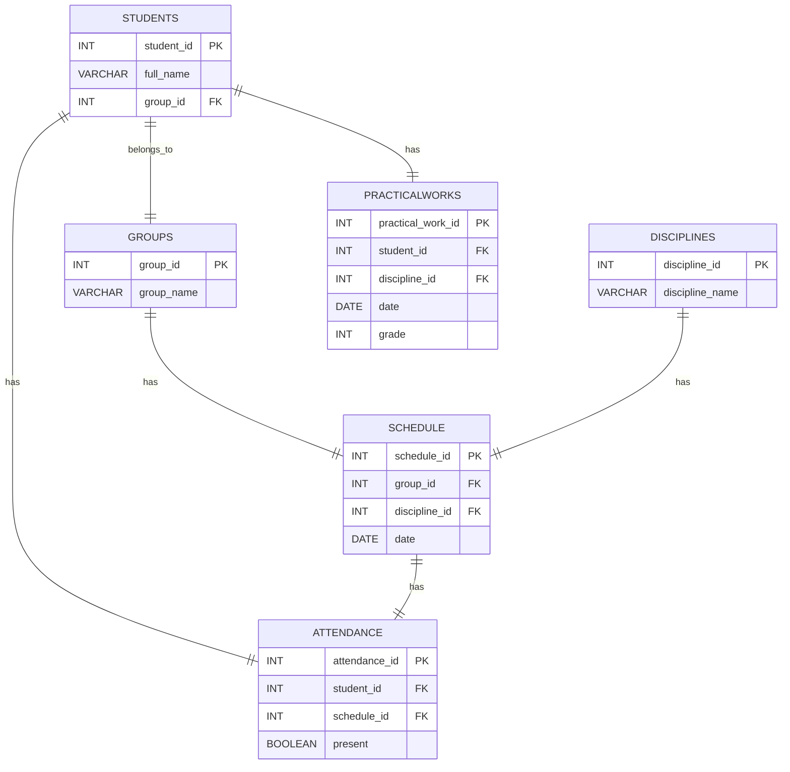

# StudentHub
Программа с графическим интерфейсом позволяющая импортировать список студентов,
вести учет посещаемости занятий, защиты практических работ и подсчет статистики
по успеваемости студента, группы по дисциплине.

## Схема базы данных

